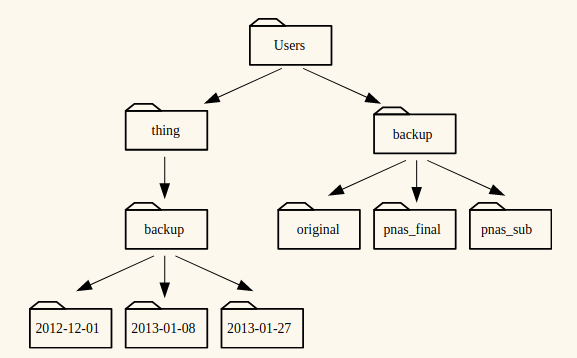

---
papersize: a4
documentclass: article
header-includes:
    - \usepackage{multicol}
    - \usepackage[margin=1in]{geometry}
    - \usepackage[magyar]{babel}
    - \newcommand{\hideFromPandoc}[1]{#1}
    - \hideFromPandoc{
        \let\Begin\begin
        \let\End\end
      }

...
# Bash Feladatok - Navigáció
A feladatok fordítással és kisebb módosításokkal a Software Carpentry-től származnak és az eredeti verziók itt érhetők el: http://software-carpentry.org/

------

\Begin{multicols}{2}

## 1. Feladat
Egyszerre több opciót is használhatsz egy parancsnál. Nézd meg, hogy mit csinál az `ls` parancs ha a `-l` opcióval használod! Mi történik, ha az `-l` és a `-h` opciót is használod?

## 2. Feladat
Alapértelmezés szerint az `ls` parancs ábécé sorrendben listázza a fájlokat. A parancs `ls -t` ezt időrendi sorrendre változtatja. Az `ls -r` megfordítja a fájlok sorrendjét listázás során. Milyen fájlt fogsz elsőként látni az `ls -tr` parancs kiadását követően? Segítség: ha a `-l` opciót is használod, az segíthet megtalálni a megoldást.

## 3. Feladat
A `/Users/amanda/data` mappából kiindulva Amanda vissza szeretne jutni a home mappájába, ami `/Users/amanda`. Az alábbiak közül melyik parancsokat használhatja erre?

1. cd .
2. cd /
3. cd /home/amanda
4. cd ../..
5. cd ~
6. cd home
7. cd ~/data/..
8. cd
9. cd ..

## 4. Feladat
Ha a fájlrendszerünk az alábbiak szerint néz ki, és a `pwd` parancs azt írja ki, hogy `/Users/thing`, akkor mit fog kiírni a `ls -F ../backup` parancs?

1. `../backup: No such file or directory`
2. `2012-12-01 2013-01-08 2013-01-27`
3. `2012-12-01/ 2013-01-08/ 2013-01-27/`
4. `original/ pnas_final/ pnas_sub/`


## 5. Feladat
Továbbra is ugyanazt a fájlrendszert vizsgálva a `pwd` parancs azt írja ki, hogy `/Users/backup`. Milyen opciókkal lehetett meghívva az `ls` parancs, ha az outputja 
```
pnas_sub/ pnas_final/ original/
```

1. ls pwd
2. ls -r -F
3. ls -r -F /Users/backup

\End{multicols}

{ width=400px }
