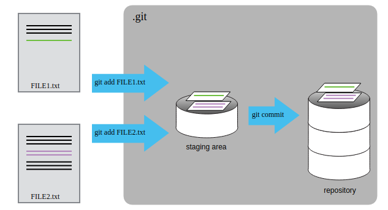

---
papersize: a4
documentclass: article
header-includes:
    - \usepackage{multicol}
    - \usepackage[margin=0.75in]{geometry}
    - \usepackage[magyar]{babel}
    - \newcommand{\hideFromPandoc}[1]{#1}
    - \hideFromPandoc{
        \let\Begin\begin
        \let\End\end
      }

...
# Git - Bevezetés
A Git egy verziókövető szoftver, amely fájlok különböző verzióinak mentésére, visszakereshetőségére és visszaállíthatóságára fókuszál. Elsősorban programkódok verziókövetésére használják, de semmi akadálya sincs más típusú fájlok verziókövetésének. A GitHub egy úgynevezett `remote`, vagyis egy olyan online tárhely, ahol másolatot tárolhatunk a helyi gépen végzett munkánkról, valamint csapatok esetében egy közös, mindenki által elért verzió tárolására illetve különböző verziók szinkronizálására használható. Ebben a feladatsorban felépítünk egy Git projektet és végigvesszük az összes fontosabb parancsot. Amennyiben elakadsz, használd a piros post it-et.

------


## Alapvető beállítások
Próbáld meg kiadni egy Git Bash-ban vagy egy Terminálban az alábbi parancsot:

```
git --version
```

Amennyiben egy verziószámot kapsz vissza, minden rendben. Ha nem működik, akkor add ki az alábbi parancsot (ügyelj minden karakterre):

```
export PATH=$PATH:/mingw64/bin
```

Ez sajnos az egyetemi rendszerben néha szükséges, mert egyes gépeken más diákok olyan szoftvert használnak, ami felülírja az úgynevezett `PATH` környezeti változót (ez definiálja, hogy hol található a git parancs). A saját eszközödön ezzel nem lesz gond, de az egyetemen szükség lehet erre a parancsra a későbbi órákon is.

A következő lépéseket csak egyszer kell elvégezned, utána már meg fogja jegyezni a git. Linuxon vagy Mac-en add ki az alábbi parancsot:

```
git config --global core.autocrlf input
```

Windowson pedig az alábbit:

```
git config --global core.autocrlf true
```

Erre azért van szükség, mert különböző operációs rendszerek máshogy kezelik a sortörés karaktert, és a fenti parancsokkal ki lehet küszöbölni az ebből fakadó problémákat (pl. ha egyikőtök Mac-en dolgozik, míg a másik Windowson, az a sortöréseknél gondot okozna, de a fenti parancsok megoldják ezt).

A következő beállítás azt adja majd meg, hogy amennyiben a Git kommunikálni szeretne velünk és szöveges inputot vár, azt milyen szövegszerkesztőben tegye. Erre a jól bevált `nano`-t fogjuk beállítani. Alapból egy `vim` nevű szoftvert használna, ami sokkal bonyolultabb. Épp ezért add ki az alábbi parancsot:

```
git config --global core.editor "nano -w"
```

Utolsó lépésként meg kell mondani a Git-nek, hogy ki vagy. Minden verzió amit elmentesz tartalmazni fog egy időbélyegzőt, egy üzenetet ami leírja a változtatásokat illetve a mentést készítő nevét és email címét. Email címnek a GitHubon használt címedet érdemes megadni. Add ki az alábbi parancsokat a `<név>` és az `<email>` placeholdereket egyértelműen a saját adataiddal helyettesítve:

```
git config --global user.name "<név>"
git config --global user.email "<email>"
```

Ezzel végeztünk a beállításokkal. Ezekre csak egyszer volt szükség.

------


Navigálj a `home` mappádba a `cd` parancs kiadásával. Itt hozz létre egy mappát a projektednek az `mkdir bolygo` paranccsal. A projektünkben bolygókról és a holdjaikról fogunk információkat gyűjteni. Lépj be a mappába a `cd bolygo` paranccsal. Ez egyelőre egy hagyományos mappa. Ahhoz, hogy ez egy úgynevezett repository legyen, meg kell mondanunk a git-nek, hogy ez egy projekt, és innentől ebben a mappában követni szeretnénk a változásokat. Új repository létrehozásához add ki a `git init` parancsot. Az alábbi választ kell adja a szoftver:

```
Initialized empty Git repository in <eleresiut>/.git/
```

Innentől ez a mappa egy git repository is. Ha kiadod az `ls` parancsot, akkor látszólag úgy tűnik, hogy ez továbbra is egy üres mappa. Ha az `ls -a` parancsot adod ki, az megjeleníti a rejtett mappákat és fájlokat is. Ekkor feltűnik egy `.git` nevű mappa. Ebben a mappában tárolódik el az összes korábbi kódverziód, a hozzájuk tartozó üzenetek és gyakorlatilag minden git specifikus adat és fájl. Ez azt is jelenti, hogy a `.git` mappa kitörlésével ez a mappa megszűnik git repository-nak lenni és elveszted a teljes projekt történetét, nem leszel képes visszaállítani korábbi verziókat, stb. Egy git repository-t tehát nagyon egyszerű felszámolni, egyszerűen törölni kell magát a projekt mappát, vagy azon belül a `.git` mappát. 

A következő hasznos parancs amit adj ki, az a `git status`. Ez mindig leírja, hogy mi a repository aktuális állapota. Ezt kell visszakapnod:

```
On branch master

No commits yet

nothing to commit (create/copy files and use "git add" to track)

```

Ez azt jelenti, hogy ez egyelőre egy teljesen új és üres repository.

------

## Fájlok létrehozása és verziókövetése

Hozzunk létre egy fájlt az alábbi paranccsal:

```
nano bolygok.txt
```

Ez megnyitja a `nano` szövegszerkesztőt. Ebbe a fájlba írjuk bele az alábbiakat:

```
Merkúr
Vénusz
```

Írjuk ki a `Ctrl+O` kombináció majd egy `Enter` segítségével és lépjünk ki a `Ctrl+X` billentyűkombinációval. Ezzel létrehoztunk egy `bolygok.txt` nevű fájlt a naprendszer első két bolygójával. Adjuk ki újra a `git status` parancsot. Az alábbit kell látnod:

```
On branch master

No commits yet

Untracked files:
  (use "git add <file>..." to include in what will be committed)
	bolygok.txt

nothing added to commit but untracked files present (use "git add" to track)
```

Ez azt jelenti, hogy még nem mentettünk el semmit, viszont a git észlelte, hogy van egy fájl, amit nem verziókövetünk. A projekt mappánkban (repositoryban) lehetnek olyan fájlok, amelyeket nem akarunk követni (pl config fájlok vagy nagy adatfájlok, esetleg olyan fájlok amelyek jelszavakat, kulcsokat tartalmaznak). A gitnek explicit meg kell adni, hogy mely fájlokat akarod követni. Ezt ki is írja, hogy a `git add` paranccsal lehet megtenni. Add ki az alábbi parancsot:

```
git add bolygok.txt
```

Látszólag semmi nem történt, de ha leellenőrzöd a `git status` parancs outputját, az alábbit kell látnod:

```
On branch master

No commits yet

Changes to be committed:
  (use "git rm --cached <file>..." to unstage)
	new file:   bolygok.txt

```

Azt látod, hogy a git már követi ezt a fájlt, és a változásokat commitálhatod, vagyis készíthetsz belőlük egy mentést ha szeretnéd. Tegyük is ezt meg. Ehhez add ki a következő parancsot:

```
git commit -m 'Start listing planets'
```

A `git commit` parancs után a `-m` opciót követően idézőjelek között mindig le kell írnod azt, hogy ez a mentés milyen változtatásokat tartalmaz. Ez az úgynevezett commit message, amely segítségével könnyebben visszakövethető minden egyes változtatás. Ez jellemzően 50 karakter alatti, tömör de mégis alapos angol nyelvű üzenet. Természetesen írhatsz magyar commit message-et is, de lehetőleg kerüld benne az ékezetes karaktereket. Az alábbihoz hasonlót kellett visszakapnod:

```
[master (root-commit) 666116e] Start listing planets
 1 file changed, 2 insertions(+)
 create mode 100644 bolygok.txt
```

Ez azt jelenti, hogy a Git lementette a válzoztatásaidat, `666116e` lett ennek a változtatásnak az egyedi ID-ja, 1 fájl változott, abba 2 extra sor került be. A `git status` parancs az alábbit kell adja:

```
On branch master
nothing to commit, working tree clean
```

Egy további hasznos parancs a `git log`. Ha ezt kiadod, ehhez hasonlót kell kapnod:

```
commit 666116e5f8213f6fe2cb6f79d326d1ad45f94121 (HEAD -> master)
Author: Olivér Kiss <kissoliver91@gmail.com>
Date:   Sun Sep 26 14:28:27 2021 +0200

    Start listing planets
```

A `log` tartalmazza az összes módosítást a hozzájuk tartozó ID-val, dátummal, üzenettel illetve a módosító személyével és email címével.

Készítsünk még néhány további `commit`ot. Add ki az alábbi parancsot:

```
nano bolygok.txt
```

A megnyílt fájlhoz írj hozzá további bolygókat, hogy a dokumentumod az alábbiakat tartalmazza:

```
Merkúr
Vénusz
Föld
Mars
```

Írjuk ki a `Ctrl+O` kombináció majd egy `Enter` segítségével és lépjünk ki a `Ctrl+X` billentyűkombinációval. A `git status` az alábbit kell visszaadja:

```
On branch master
Changes not staged for commit:
  (use "git add <file>..." to update what will be committed)
  (use "git restore <file>..." to discard changes in working directory)
	modified:   bolygok.txt

no changes added to commit (use "git add" and/or "git commit -a")

```

Ez azt jelenti, hogy a git észleli, hogy módosítottuk a `bolygok.txt` fájlt, viszont erről nem mondtuk egyelőre azt, hogy készen áll a mentésre. Ahhoz, hogy egy fájlt kijelöljünk mentésre úgymond `stage`-elni kell. Ennek az a lényege, hogy egy projekten belül lehet többszáz módosított fájlunk, de azokról nem kell egyszerre mentést készítünk. Lehet, hogy egyes módosításaink már készen állnak, mások még nem. A `stage`-eléssel gyakorlatilag megmondjuk, hogy mely fájlokból akarunk most mentést készíteni, és melyik fájlok módosításaihoz fűzzük hozzá a megadott commit message-et. A `stage`-eléshez a `git add` parancsot használhatjuk. Írd be az alábbit:

```
git add bolygok.txt
```

A `git status` az alábbit kell visszaadja:

```
On branch master
Changes to be committed:
  (use "git restore --staged <file>..." to unstage)
	modified:   bolygok.txt

```

Vagyis módosítottuk a `bolygok.txt` fájlt, és ez készen áll a mentésre, mert `stage`-eltük is. Mentsük el, vagyis commitáljuk ezeket a módosításokat az alábbi paranccsal:

```
git commit -m 'add two more planets to the collection'
```

Ehhez hasonlót kell kapnod:

```
[master 2c709bd] add two more planets to the collection
 1 file changed, 2 insertions(+)
```

A `git status` az alábbit kell eredményezze:

```
On branch master
nothing to commit, working tree clean
```

A `git log` paranccsal kiíratva a logot látnod kell mindkét commitodat:

```
commit 2c709bdc7eebceefd6a1d4ab91ebe57956821acb (HEAD -> master)
Author: Olivér Kiss <kissoliver91@gmail.com>
Date:   Sun Sep 26 14:44:35 2021 +0200

    add two more planets to the collection

commit 666116e5f8213f6fe2cb6f79d326d1ad45f94121
Author: Olivér Kiss <kissoliver91@gmail.com>
Date:   Sun Sep 26 14:28:27 2021 +0200

    Start listing planets
```

Végezzünk több módosítást is a következő lépésben. Egyrészt add ki az alábbi parancsot:

```
nano bolygok.txt
```

A megnyílt fájlhoz írj hozzá további bolygókat, hogy a dokumentumod az alábbiakat tartalmazza:

```
Merkúr
Vénusz
Föld
Mars
Jupiter
Szaturnusz
```

Írjuk ki a `Ctrl+O` kombináció majd egy `Enter` segítségével és lépjünk ki a `Ctrl+X` billentyűkombinációval. A `git status` az alábbit kell visszaadja:

```
On branch master
Changes not staged for commit:
  (use "git add <file>..." to update what will be committed)
  (use "git restore <file>..." to discard changes in working directory)
	modified:   bolygok.txt

no changes added to commit (use "git add" and/or "git commit -a")

```

Ezzel egyelőre nem vagyunk kész, nem szeretnénk elmenteni, van még 2 bolygó amit majd hozzá szeretnénk írni. Közben elkezdünk dolgozni a holdak gyűjtésén is. A repón belül létrehozunk ezeknek egy külön mappát. Add ki az `mkdir holdak` parancsot. Ezen belül minden bolygó holdjait egy külön dokumentumban fogjuk listázni. Kezdjük a Marssal. Add ki az alábbi parancsot:

```
nano holdak/mars.txt
```

Ez megnyitja a `nano` szövegszerkesztőt. Ebbe a fájlba írjuk bele az alábbiakat:

```
Phobos
Deimos
```
Írjuk ki a `Ctrl+O` kombináció majd egy `Enter` segítségével és lépjünk ki a `Ctrl+X` billentyűkombinációval. A `git status` az alábbit kell visszaadja:

```
On branch master
Changes not staged for commit:
  (use "git add <file>..." to update what will be committed)
  (use "git restore <file>..." to discard changes in working directory)
	modified:   bolygok.txt

Untracked files:
  (use "git add <file>..." to include in what will be committed)
	holdak/

no changes added to commit (use "git add" and/or "git commit -a")
```

Vagyis a git észleli, hogy egyrész vannak módosítások a `bolygok.txt` fájlban, illetve megjelent egy `holdak` nevű mappa, amit eddig nem követtünk. A Mars holdjait sikeresen összeszedtük, mentsük el azt a dokumentumot (a bolygók gyűjtésével még nem vagyunk kész). Ehhez először explicit meg kell adni, hogy a `holdak/mars.txt` fájlt követni akarjuk. Ehhez add ki a következő parancsot:

```
git add holdak/mars.txt
```

A `git status` ezek után az alábbi kell legyen:

```
On branch master
Changes to be committed:
  (use "git restore --staged <file>..." to unstage)
	new file:   holdak/mars.txt

Changes not staged for commit:
  (use "git add <file>..." to update what will be committed)
  (use "git restore <file>..." to discard changes in working directory)
	modified:   bolygok.txt

```

Vagyis a mars holdjait tartalmazó dokumentum készen áll a mentésre (commitra), a `bolygok.txt` fájl pedig módosításokat tartalmaz ugyan, de azokat nem jelöltük ki mentésre. Mentsük el a stage-elt módosításainkat:

```
git commit -m 'collect the moons of mars'
```

Az alábbit kell látnunk:

```
[master 4b50589] collect the moons of mars
 1 file changed, 2 insertions(+)
 create mode 100644 holdak/mars.txt
```

A `git status` továbbra is jelzi, hogy a `bolygok.txt` olyan módosításokat tartalmaz amiket nem mentettünk még el:

```
On branch master
Changes not staged for commit:
  (use "git add <file>..." to update what will be committed)
  (use "git restore <file>..." to discard changes in working directory)
	modified:   bolygok.txt

no changes added to commit (use "git add" and/or "git commit -a")
```

A `git log` tartalmazza mindhárom commitot:

```
commit 4b50589e5ced929892c3f1e907d9ccf8a39ed807 (HEAD -> master)
Author: Olivér Kiss <kissoliver91@gmail.com>
Date:   Sun Sep 26 14:56:49 2021 +0200

    collect the moons of mars

commit 2c709bdc7eebceefd6a1d4ab91ebe57956821acb
Author: Olivér Kiss <kissoliver91@gmail.com>
Date:   Sun Sep 26 14:44:35 2021 +0200

    add two more planets to the collection`

commit 666116e5f8213f6fe2cb6f79d326d1ad45f94121
Author: Olivér Kiss <kissoliver91@gmail.com>
Date:   Sun Sep 26 14:28:27 2021 +0200

    Start listing planets
```

Következő lépésként fejezzük be a bolygók gyűjtését. Add ki az alábbi parancsot:

```
nano bolygok.txt
```

A megnyílt fájlhoz írd hozzá a fennmaradó bolygókat, hogy a dokumentumod az alábbiakat tartalmazza:

```
Merkúr
Vénusz
Föld
Mars
Jupiter
Szaturnusz
Uránusz
Neptunusz
```

Írjuk ki a `Ctrl+O` kombináció majd egy `Enter` segítségével és lépjünk ki a `Ctrl+X` billentyűkombinációval. A `git status` az alábbit kell visszaadja:

```
On branch master
Changes not staged for commit:
  (use "git add <file>..." to update what will be committed)
  (use "git restore <file>..." to discard changes in working directory)
	modified:   bolygok.txt

no changes added to commit (use "git add" and/or "git commit -a")

```

Stage-eljük és commitáljuk a változtatásokat:

```
git add bolygok.txt
git commit -m 'finish collecting all planets'
```

Az alábbit kell látnod:

```
[master 7a24f57] finish collecting all planets
 1 file changed, 4 insertions(+)
```

A `git status` az alábbi:

```
On branch master
nothing to commit, working tree clean
```

A `git log` immáron 4 commitot tartalmaz. A log egy bizonyos számú commit után egy interaktív ablakban nyílik meg és nem írja tele a képernyőt. Ebből a `q` billentyű lenyomásával léphetsz ki.

{ width=400px }

-------------

## Korábbi verziók visszaállítása

Tegyük fel, hogy véletlenül a Plútót is hozzáadjuk a bolygók listájához. Add ki az alábbi parancsot:

```
nano bolygok.txt
```

A megnyílt fájlhoz írd hozzá a Plútót. Írjuk ki a `Ctrl+O` kombináció majd egy `Enter` segítségével és lépjünk ki a `Ctrl+X` billentyűkombinációval. A `git status` az alábbit kell visszaadja:

```
On branch master
Changes not staged for commit:
  (use "git add <file>..." to update what will be committed)
  (use "git restore <file>..." to discard changes in working directory)
	modified:   bolygok.txt

no changes added to commit (use "git add" and/or "git commit -a")

```

Stage-eljük és commitáljuk a változtatásokat:

```
git add bolygok.txt
git commit -m 'add pluto to list of planets'
```

Az alábbit kell látnod:

```
[master e46cad0] add pluto to list of planets
 1 file changed, 1 insertion(+)
```

Ez nyilvánvalóan egy hiba volt, és szeretnénk visszaállítani a korábbi verziót. Ehhez szükség lesz annak a módosításnak az ID-jára amit vissza szeretnénk csinálni. Ez jelen esetben az utolsó módosítás. Nálam `e46cad0` volt az ID (lásd a legutóbbi outputban), nálad más lesz ez. Ezt az ID-t hosszabb formában a `git log` is tartalmazza, nálam ez `e46cad080a0a44bfcb91f16aaf3e762c748d930a`. Nálad ez is más lesz, de a rövid formátum a hosszú formátum első 7 karaktere. Az adott committal végrehajtott változtatások visszavonásához a `git revert` parancs használható, aminek meg kell adni, hogy melyik commitot akarod visszavonni. Esetemben a parancs:

```
git revert e46cad0
```

Használhatod akár a rövid, akár a hosszú ID-t. A git meg fog nyitni egy `nano` szerkesztőt. Ebben meg kell adnond egy commit message-et, hiszen ez a visszavonás is egy új commitként fog megjelenni a rendszerben (így akár az a verzió is visszaállítható lesz a későbbiekben, amelyben szerepel a Plútó). A git felajánl egy alapértelmezett commit message-et:

```
Revert "add pluto to list of planets"

This reverts commit e46cad080a0a44bfcb91f16aaf3e762c748d930a.
```

A `#` karakterrel kezdődő sorok kommentek, nem lesznek részei a commit message-nek. Ha az alapértelmezett message nem elég leíró, akkor nyugodtan módosíthatod a `nano`-ban. Ha elkészültél akkor írd ki a `Ctrl+O` kombináció majd egy `Enter` segítségével és lépjünk ki a `Ctrl+X` billentyűkombinációval. Az alábbihoz hasonlót kell látnod:

```
[master 3ae7126] Revert "add pluto to list of planets"
 1 file changed, 1 deletion(-)
```

A `git status` az alábbi:

```
On branch master
nothing to commit, working tree clean
```

A `git log` tartalmaz egy extra commitot, a módosítások visszaállítását. Tehát összesen már 6 commitod kell legyen. Ellenőrizheted a `bolygok.txt` fájl tartalmát a `cat bolygok.txt` paranccsal, a Plútónak tényleg el kellett tűnnie.

A `git revert` parancs tehát egy megadott commitban található módosítások visszavonására szolgál. Előfordulhat azonban, hogy nem módosításokat szeretnél visszavonni, hanem a egy fájl meghatározott pillanatában létező verzióját szeretnéd visszahozni. A `git log --oneline` parancs egy tömörebb logot ír a képernyőre, nálam ez az alábbi:

```
3ae7126 (HEAD -> master) Revert "add pluto to list of planets"
e46cad0 add pluto to list of planets
7a24f57 finish collecting all planets
4b50589 collect the moons of mars
2c709bd add two more planets to the collection
666116e Start listing planets
```

Ezek a commit message-ek, és a commitok ID-jai tömör formában. Tegyük fel, hogy én a `2c709bd add two more planets to the collection` commitnál szereplő verzióját szeretném visszakapni a `bolygok.txt` fájlnak. Ezt a `git checkout` paranccsal tehetem meg. Az ID-t cseréld ki arra, ami a te repódban ahhoz a commithoz tartozik. A parancs az alábbi:

```
git checkout 2c709bd -- bolygok.txt
```

Ha kiadom a `cat bolygok.txt` parancsot, az alábbit kapom:

```
Merkúr
Vénusz
Föld
Mars
```

Vagyis tényleg visszaállt arra a verzióra a fájl. Ha emlékszel, akkor a mars holdjait tartalmazó dokumentum akkor még nem létezett, azt egy committal később hoztuk létre. Most viszont továbbra is szerepel a mappánkban a holdakat tartalmazó dokumentum. Vagyis a `git checkout` parancs a többi fájl érintetlenül hagyása mellett állította vissza a megadott fájl adott verzióját. A git status az alábbi:

```
On branch master
Changes to be committed:
  (use "git restore --staged <file>..." to unstage)
	modified:   bolygok.txt
```

Vagyis a git ezt egy ugyanolyan módosításnak tekinti, mintha kézzel állítottuk volna vissza a korábbi verziót. Azt jelzi, hogy a `bolygok.txt` fájl megváltozott és készen áll arra, hogy commitáljuk. Ha tényleg vissza szeretnénk állítani ezt az állapotot akkor egy committal megtehetjük. Ha csak meg akartuk nézni, hogy milyen volt ez a fájl az adott commitnál akkor visszatérhetünk a `git checkout` parancs előtti ponthoz az alábbi paranccsal:

```
git checkout HEAD bolygok.txt
```

Ez a parancs annyit tesz, hogy a `bolygok.txt` fájlt szeretnénk visszaállítani az időben legfrissebb commitban található verzióra (ez az úgynevezett HEAD commit). A `git status` ezek után

```
On branch master
nothing to commit, working tree clean
```

Ha kiadom a `cat bolygok.txt` parancsot, az alábbit kapom:

```
Merkúr
Vénusz
Föld
Mars
Jupiter
Szaturnusz
Uránusz
Neptunusz
```

Vagyis tényleg visszaállítottuk a legfrissebb verziót.

-------------

## Ma az alábbi parancsokat tanultad meg használni:

| Parancs                           | Jelentés                                                           |
|-----------------------------------|--------------------------------------------------------------------|
| `git init`                        | Repository létrehozása a jelenlegi mappában                        |
| `git status`                      | A repository státusza                                              |
| `git log`                         | Commit történet kiírása                                            |
| `git log --oneline`               | Tömör commit történet                                              |
| `git add <fájl>`                  | Fájl követése vagy stage-elése                                     |
| `git commit -m <message>`         | Stage-elt változtatások commitálása                                |
| `git revert <commit>`             | Egy adott commit változtatásainak visszavonása                     |
| `git checkout <commit> -- <fájl>` | Egy fájl adott verziójának visszaállítása                          |
| `git checkout HEAD <fájl>`        | Egy fájl legfrissebb commitban szereplő verziójának visszaállítása |
