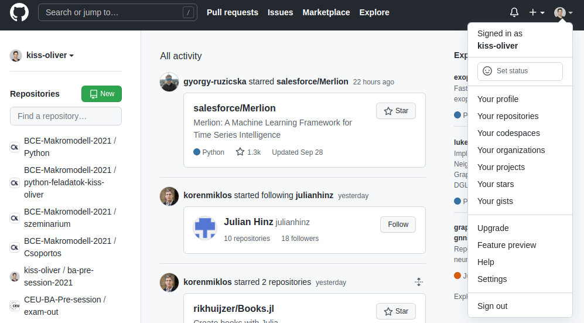
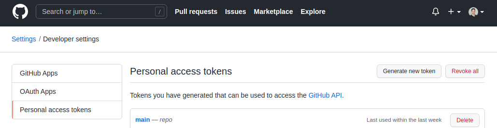
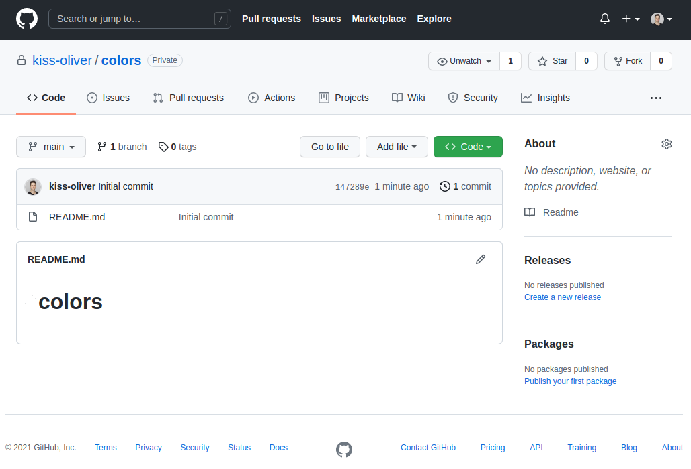
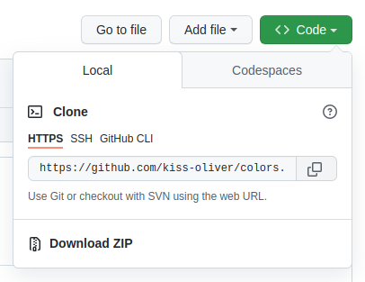
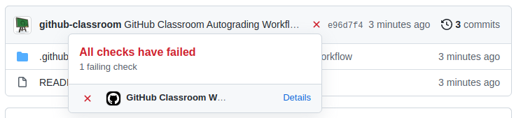
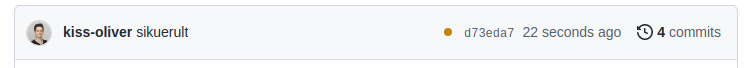
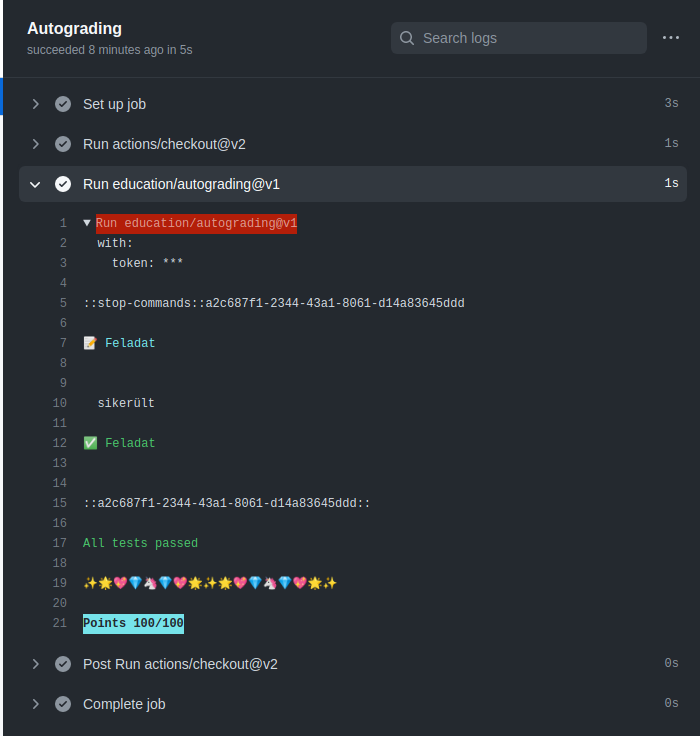

---
papersize: a4
documentclass: article
header-includes:
    - \usepackage{multicol}
    - \usepackage[margin=0.75in]{geometry}
    - \usepackage[magyar]{babel}
    - \newcommand{\hideFromPandoc}[1]{#1}
    - \hideFromPandoc{
        \let\Begin\begin
        \let\End\end
      }

...
# GitHub - Bevezetés
A GitHub egy úgynevezett `remote`, vagyis egy olyan online tárhely, ahol másolatot tárolhatunk a helyi gépen található Git repository-ról, valamint csapatok esetében egy közös, mindenki által elért verzió tárolására illetve különböző verziók szinkronizálására használható. Ebben a feladatsorban felépítünk egy Git projektet GitHubról kiindulva és végigvesszük az összes fontosabb parancsot. Amennyiben elakadsz, használd a piros post it-et.

------


## Alapvető beállítások egyetemi gépen dolgozóknak
Próbáld meg kiadni egy Git Bash-ban vagy egy Terminálban az alábbi parancsot:

```
git --version
```

Amennyiben egy verziószámot kapsz vissza, minden rendben. Ha nem működik és egyetemi gépen dolgozol, akkor add ki az alábbi parancsokat (ügyelj minden karakterre):

```
export PATH=$PATH:/mingw64/bin
git config --global core.pager cat
```

## GitHub beállítások

Mielőtt nekiállnánk a GitHub használatának, nyiss egy Git Bash-t vagy Terminált és add ki az alábbi parancsot:

```
git config credential.helper store
```

Így a Git csak egyszer fogja kérni a GitHub felhasználóneved és jelszavad. Ezután menj a `https://github.com` oldalra és jelentkezz be. Kattints a jobb felső sarokban a profilképedre, majd a lenyíló menüben a `Settings`-re. Bal oldalon válaszd ki a `Developer Settings`-et, majd azon belül a `Personal access tokens` fület. 

{ width=330px }
{ width=330px }

Kattints a `Generate new token` feliratra. A megjelenő opcióknál `Note`-ként adj meg annyit, hogy `main`, Expiration-nek állíts be 90 napot, Scope-nak pedig pipáld ki a félkövér `repo` felirat előtti jelölőnégyzetet. Ezután kattints a zöld `Generate token` gombra.

A GitHub ki fog írni egy hosszú, betűkből és számokból álló karakterláncot. Ezt mentsd el, egyes eszközökön (elsősorban Mac-en és Linuxon, de esetenként Windowson is) ezt kell majd megadnod biztonsági okokból a sima GitHub jelszavad helyett. Ezt a karakterláncot most látod GitHubon utoljára, nem fogja többször megjeleníteni neked, így ha nem mented el akkor újat kell generálni. Ha új tokent generálsz előtte töröld a régit.

## GitHub Repository készítése

Készíts egy új Git repository-t. Ezt múlt órán megtettük a saját eszközünkön, de van rá lehetőség GitHubon is. Ha tudod, hogy a repositorydat nem csak a saját gépeden hanem GitHubon is el szeretnéd tárolni, akkor egyszerűbb azt GitHubon létrehozni. Ellenkező esetben utólag kell a saját eszközödön konfigurálni a repositorydban, hogy hova kell mentést készíteni GitHubon. Ez nem bonyolult, de könnyebb ha nem kell ezt kézzel beállítani.

Menj vissza a GitHub főoldalára a bal felső sarokban lévő Octocat logóra kattintva. Bal oldalon a Repositories felirat mellett kattints a zöld `New` gombra. Itt meg kell adnod az új repository nevét a felhasználóneved után (ez lesz a mappád neve amiben dolgozni fogsz a gépen). Ma színekről fogunk információkat gyűjteni, úgyhogy legyen a repository neve `colors`. Megadhatsz egy leírást (ez kizárólag GitHubon jelenik majd meg). Ezt követően választanod kell, hogy a repository publikus legyen (mindenki a világon látja, de módosítani csak azok tudják akiknek ezt lehetővé teszed) vagy privát (csak az látja és módosíthatja, akinek ezt engedélyezed). Legyen ez most egy Private repository.

Végül 3 lehetőséget kínál még a GitHub:

- `Add a README file`: Ezt pipáld ki, ezzel a repositoryd nem lesz üres, hanem rögtön lesz benne egy readme fájl. Így könnyebb lesz vele dolgozni.
- `Add .gitignore`: Erre ma nem lesz szükségünk. A `.gitignore` egy speciális fájl amelyben megadhatod a Gitnek, hogy milyen fájlokat hagyjon teljesen figyelmen kívül a gépeden a repositoryban. Ez hasznos ha például adatfájlokat nem szeretnél soha követni.
- `Choose a license`: Elsősorban akkor lényeges, ha nyílt forráskódú szoftvert vagy bármilyen más intellektuáklis terméket hozol létre.

Tehát összességében létrehozol egy `color` nevű privát repository-t egy README fájllal. A befejezéshez kattints a nagy zöld Create repository gombra. Ez automatikusan létrehozza a repositoryt és oda is irányít. Láthatod a létrehozott `README.md` fájlt, és számos további információt a repository-ról.



## A repository clone-ozása

Ez a repository egyelőre csak GitHubon létezik. Ha egy GitHubon létező repository-t a saját gépedre másolsz az clone-ozásnak nevezik. Ehhez szükséged lesz a GitHub repository elérési útvonalára. Kattints jobb felül a zöld `Code` gombra, ami megmutatja neked az ehhez szükséges linket. Három opciót kínál fel: HTTPS, SSH, GitHub CLI. Válaszd a HTTPS-t. Másold ki a linket. 

{ width=230px }

Ezt követően nyiss egy Git Bash-t vagy Terminált. Navigálj a mappába ahol dolgozni szeretnél. Ezt követően clone-ozd a repositoryt az alábbi paranccsal (a `<link>`-et helyettesítsd a kimásolt linkkel):

```
git clone <link>
```

A Git kérni fogja a GitHub felhasználóneved és jelszavad. Ez 2 módon történhet: vagy egy böngésző ablakot ad, amelyben be tudsz jelentkezni, vagy magában a Git Bash/Terminál ablakban kéri ezt. Utóbbi esetben jelszó helyett az előzőleg elkészített personal access tokenedet kell megadnod. A jelszó gépelése közben ebben az esetben nem fogsz sem karaktereket sem csillagokat vagy bármi mást látni. Ettől függetlenül érzékeli azt, viszont biztonsági okokból semmit nem jelenít meg, hogy még a jelszó hossza se legyen ismert senkinek rajtad kívül. 

Az alábbihoz hasonlót kell visszakapnod sikeres clone-ozás esetén:

```
(main) oliver@Hactar:~$ git clone https://github.com/kiss-oliver/colors.git
Cloning into 'colors'...
Username for 'https://github.com': kiss-oliver
Password for 'https://kiss-oliver@github.com': 
remote: Enumerating objects: 3, done.
remote: Counting objects: 100% (3/3), done.
remote: Total 3 (delta 0), reused 0 (delta 0), pack-reused 0
Receiving objects: 100% (3/3), done.
```

Egy `ls` parancs kiadását követően látnod kell egy újonnan létrejött mappát a repository nevével (`colors`). Navigálj a mappába a `cd colors` paranccsal. Ha kilistázod a tartalmát, látnod kell a GitHub által létrehozott `README.md` fájlt:

```
(main) oliver@Hactar:~/colors$ ls
README.md
```

Ez egy git repository, tehát a szokásos git parancsoknak is működnie kell. A `git log` az alábbihoz hasonlót kell mutasson:

```
commit 147289eb828b623c38de7c5801014b4a40a9aca2 (HEAD -> main, origin/main, origin/HEAD)
Author: Olivér Kiss <Kiss_Oliver@phd.ceu.edu>
Date:   Tue Sep 28 15:43:36 2021 +0200

    Initial commit
```

A `git status` pedig

```
On branch main
Your branch is up to date with 'origin/main'.

nothing to commit, working tree clean
```

## Módosítások, push és pull

Készíts egy új fájlt a repositoryban. Add ki a `nano szinek.txt` parancsot. A `nano` szerkesztőben sorolj fel pár színt, például:

```
Sárga
Fekete
Kék
```

Mentsd el a `Ctrl+O` billentyűkombináció majd egy `Enter` segítségével, majd lépj ki `Ctrl+X` kombinációval. A `git status` mutatja, hogy létrehoztál egy új fájlt. Stage-eld és commitáld. Ezután a git logban 2 commitot kell látnod, a status pedig az alábbi kell legyen:

```
On branch main
Your branch is ahead of 'origin/main' by 1 commit.
  (use "git push" to publish your local commits)

nothing to commit, working tree clean
```

Ez ez új commit egyelőre csak a saját gépeden van meg. Ha leelenőrzöd a GitHubot, ott nem fog szerepelni a `szinek.txt` fájl. Ahhoz, hogy a helyi commitokat GitHubra mozgasd ki kell adni egy parancsot. Ez az úgynevezett pusholás. A parancs amire szükséged lesz szimplán:

```
git push
```

A parancs kiadását követően az alábbihoz hasonlót kell látnod:

```
Enumerating objects: 4, done.
Counting objects: 100% (4/4), done.
Delta compression using up to 4 threads
Compressing objects: 100% (2/2), done.
Writing objects: 100% (3/3), 311 bytes | 311.00 KiB/s, done.
Total 3 (delta 0), reused 0 (delta 0), pack-reused 0
To https://github.com/kiss-oliver/colors.git
   147289e..9c5ef5f  main -> main
```

Ha frissíted a böngésződet, a GitHubon is megjelenik a commit illetve a fájl. Végezz még pár módosítás-stage-commit-push lépést hogy begyakorold a folyamatot.


A `git push` paranccsal tehát az eszközödön végzett commitokat mozgathatod a GitHubra. Ennek az ellentéte a `git pull`, amellyel a GitHubon meglévő, de nem a saját eszközödön történt módosításokat húzhatod le a GitHubról. Például ha két ember, Adrienn és Balázs kooperálnak egy projekten, az alábbi egy standard workflow:

1. Adrienn létrehozza a repository-t GitHubon.
2. Adrienn és Balázs is clone-ozza a repository-t a saját eszközére.
3. Adrienn elkezd dolgozni a projekten és végez néhány commitot. Ezeket pusholja GitHubra, hogy Balázs is elérje őket.
4. Balázs pullolja Adrienn módosításait. Ezután ő is végez pár módosítást és commitolja azokat. A cáltoztatásait visszapusholja GitHubra.
5. Adrienn pullolja Balázs változtatásait majd folytatja a munkát, a módosításait visszapusholja.
6. És így tovább...

A következő lépésben ezt fogjuk szimulálni, amihez párban kell dolgoznotok. Ha idáig eljutottál de a párod még nem, akkor segíts neki eljutni idáig, majd folytassátok közösen a munkát.

------------------------------------

## GitHub kollaboráció szimulálása

Egyikőtök legyen a repository Tulajdonos a másik pedig a Közreműködő. Miután megcsináltátok a feladatot cseréljetek és csináljátok meg újra fordított szerepekkel.

1. A Tulajdonos menjen fel GitHubra és hozzon létre egy új privát repository-t.
2. A repository jobb felső sarkában kattintson a Settings-re majd a `Manage access` fülre. A nagy zöld `Invite a collaborator` gombra kattintást követően adja meg a Közreműködő GitHub felhasználónevét és hívja meg a repository-ba.
3. Közreműködő ellenőrizze az emailjeit, és fogadja el a meghívást az emailben található linkre kattintva.
4. Tulajdonos és Közreműködő is cloneozza a repositoryt a saját gépére. Figyeljetek arra, hogy ne clone-ozzátok a repositoryt egy másikon belülre (navigáljatok egy olyan helyre, ami nem egy repository belseje)!
5. Tulajdonos végezzen egy módosítást, commitolja, majd pusholja fel.
6. Közreműködő pullolja a módosítást, végezzen el egy további módosítást és commitot, majd pusholja fel.
7. Tulajdonos pullolja Közreműködő módosítását.
8. Nézzétek meg a `git log`ot, láthatjátok hogy mindkettőtöknél pontosan ugyanaz a repository történet, tehát teljesen szinkronban vannak a pusholás, pullolás és egy remote segítségével. Váltsatok szerepet és végezzétek el a feladatot úgy is. 

----------------------------------------

## Automatikus merge és merge conflict

Egy potenciális problémaforrás ha két ember egyszerre módosítja ugyanazt a fájlt és próbálja meg pusholni a repositoryba. Ebben az esetben két dolog lehetséges:

1. A két ember a fájl más-más részeit módosította, így a módosítások automatikusan összevonhatók.
2. A két ember a fájl ugyanazon részét módosította. Ez úgynevezett merge conflictot eredményez, és explicit meg kell adni, hogy a módosítások közül mi legyen megtartva.

A következőkben ezeket fogjuk szimulálni. Dolgozz tovább a pároddal a mindkettőtök által elért repositoryk egyikén (mindegy melyiken). Egyikőtöket jelölje `A`, míg a másikat `B`.

1. `A` és `B` is navigáljon a repositoryba majd adja ki a `git pull` parancsot, hogy garantáltan minden szinkronban legyen kezdéskor.
2. `A` nyisson meg egy már létező fájlt a repositoryban majd írjon a fájl elejére egy új sort. Mentse el és commitolja a módosításokat, majd pusholja azokat GitHubra.
3. `B` nyissa meg ugyanazt a fájlt majd írjon a fájl végére egy új sort. Mentse el és commitolja a módosításokat. Próbálja meg pusholni a módosításait. Az alábbi hibaüzenetet kell kapnia:
```
 ! [rejected]        main -> main (fetch first)
error: failed to push some refs to 'https://github.com/kiss-oliver/colors.git'
hint: Updates were rejected because the remote contains work that you do
hint: not have locally. This is usually caused by another repository pushing
hint: to the same ref. You may want to first integrate the remote changes
hint: (e.g., 'git pull ...') before pushing again.
hint: See the 'Note about fast-forwards' in 'git push --help' for details.
```
4. Ez azt jelenti, hogy a módosított fájl idők közben módosult GitHubon, ezért nem hajlandó pusholni. A megoldáshoz `B` adja ki a `git pull` parancsot. Meg kell jelennie egy `nano` ablaknak egy alábbihoz hasonló üzenettel:
```
Merge branch 'main' of https://github.com/kiss-oliver/colors
# Please enter a commit message to explain why this merge is necessary,
# especially if it merges an updated upstream into a topic branch.
#
# Lines starting with '#' will be ignored, and an empty message aborts
# the commit.
```
5. Ha ez történik, az azt jelenti, hogy a Git képes automatikusan összefésülni a módosításokat. Ez egy önálló commit lesz, amihez tartoznia kell egy commit message-nek. Ezt az üzenetet ebben az ablakban kell megadni. Az alapértelmezett üzenet a `#` nélküli, első sorban található. Ezt módosíthatja `B` kedve szerint. Ha jó a default message vagy befejezte annak módosítását akkor a `Ctrl+O` kombináció majd egy `Enter` segítségével elmentheti azt és egy `Ctrl+X` kombinációval kiléphet. Az alábbihoz hasonló üzenetet kell látni sikeres merge esetén:
```
Auto-merging szinek.txt
Merge made by the 'recursive' strategy.
 szinek.txt | 1 +
 1 file changed, 1 insertion(+)
```
6. A merge a saját eszközön történt csak meg. Ahhoz, hogy ez GitHubon is megjelenjen `B` adja ki a `git push` parancsot aminek minden probléma nélkül le kell futnia.
7. `A` adja ki a `git pull` parancsot. A repositoryk újra szinkronban vannak és a fájl egyaránt tartalmazza `A` és `B` módosításait.
8. Cseréljetek szerepet és ismételjétek meg a feladatot, hogy `A`-nak kelljen mergelnie.


---------------------------------------

A következő lépésben előidézünk majd feloldunk egy úgynevezett merge conflictot, vagyis egy olyan helyzetet amikor két ember egymástól függetlenül a fájl azonos részét módosítja és így nem lehetséges azokat automatikusan összefésülni. Dolgozz tovább a pároddal a mindkettőtök által elért repositoryk egyikén (mindegy melyiken). Egyikőtöket jelölje `A`, míg a másikat `B`.

1. `A` és `B` is navigáljon a repositoryba majd adja ki a `git pull` parancsot, hogy garantáltan minden szinkronban legyen kezdéskor.
2. `A` nyisson meg egy már létező fájlt a repositoryban majd írjon a fájl elejére egy új sort. Mentse el és commitolja a módosításokat, majd pusholja azokat GitHubra.
3. `B` nyissa meg ugyanazt a fájlt majd írjon ugyancsak a fájl elejére egy új sort. Mentse el és commitolja a módosításokat. Próbálja meg pusholni a módosításait. A korábbi példában látott hibaüzenetet kell kapnia:
```
 ! [rejected]        main -> main (fetch first)
error: failed to push some refs to 'https://github.com/kiss-oliver/colors.git'
hint: Updates were rejected because the remote contains work that you do
hint: not have locally. This is usually caused by another repository pushing
hint: to the same ref. You may want to first integrate the remote changes
hint: (e.g., 'git pull ...') before pushing again.
hint: See the 'Note about fast-forwards' in 'git push --help' for details.
```
4. Ez ismét jelenti, hogy a módosított fájl idők közben módosult GitHubon, ezért nem hajlandó pusholni. A megoldáshoz `B` adja ki a `git pull` parancsot. Ezúttal nem jelenik meg a `nano` ablak, helyette az alábbi hibaüzenet látható:
```
CONFLICT (content): Merge conflict in ...
Automatic merge failed; fix conflicts and then commit the result.
```
5. Ez azt jelenti, hogy nem sikerült a módosításokat automatikusan összefésülni és kézzel kell megoldani a problémát. `B` nyissa meg a problémás fájlt a `nano` szerkesztővel. Az alábbihoz hasonlót kell látnia:
```
<<<<<<< HEAD
A B által begépelt első sor
=======
Az A által begépelt első sor
>>>>>>> 9a93e3a5de8f5edc407438f1a04ba69449678704
További sorok
```
6. A git belenyúlt a fájlba, és az alábbi logika szerint módosította azt:
 - Ahol merge conflict van, ott `<<<<<<< HEAD` után a `B` által végzett módosításokat jeleníti meg. Ezt egy `=======` sor zárja, majd az `A` által végzett módosításokat jeleníti meg. Ezt egy `>>>>>>>` és `A` módosításainak ID-ja zárja.
 - A merge conflictban nem érintett részeket érintetlenül hagyja.
7. `B`-nek el kell döntenie, hogy mit szeretne meghagyni. Módosítsa a fájlt annak megfelelően, majd mentse el a fájlt és lépjen ki a `nano`-ból. Például lehet a kész fájl:
```
A B által begépelt első sor
Az A által begépelt első sor
További sorok
```
vagy
```
A B által begépelt első sor
További sorok
```
vagy
```
Az A által begépelt első sor
További sorok
```
vagy bármi más.
8. `B` stage-elje ezt a módosítást. Ezt követően a git status is jelzi, hogy megoldottad a problémát:
```
All conflicts fixed but you are still merging.
  (use "git commit" to conclude merge)
```
9. `B` commitálja a módosítást és pusholja fel. Így már gond nélkül mennie kell a pushnak.
10. `A` adja ki a `git pull` parancsot. A repositoryk újra szinkronban vannak és a fájl mindenhol a `B` által elvégzett megoldást tartalmazza.
11. Cseréljetek szerepet és ismételjétek meg a feladatot, hogy `A`-nak kelljen merge conflictot feloldania.

---------------------

## GitHub Classroom

Innentől ismét dolgozhatsz önállóan. Az első órán elfogadtad az önálló és csoportos feladatokat GitHub Classoomon. Az önálló feladatokhoz létrejött GitHubon egy privát repositoryd amit csak te illetve az oktatók látnak. A csoportos feladatok ugyancsak egy privát repositoryban vannak, amit a csoport minden tagja és az oktatók látnak. Ha a jobb felső sarokban a profilképedre kattintasz GitHubon majd kiválasztod a `Your repositories` menüpontot, akkor látnod kell mindkét repository-t. Ezeket clone-ozhatod a gépedre, megoldhatod a feladatokat, majd a megoldásaidat commitálnod kell és vissza kell pusholni, tehát a mai órán látottak szerint kell majd megoldanod a feladatokat. Értelemszerűen a csoportos feladatoknál előjöhet merge conflict is ha ketten szerkesztitek ugyanazt a kódot, ezt a példához hasonlóan fel tudjátok oldani. Egy extra funkció a kódok tesztelése. Minden push után automatikusan lefut a repositoryban GitHubon egy sornyi teszt, ami ellenőrzi a megoldásod helyességét. Ez minden push után lefut és korlátlan mennyiségben pusholhatsz (próbálkozhatsz a megoldással). Utolsó lépésként ennek a működését fogjuk szimulálni.

1. Nyisd meg az alábbi oldalt: `makromodell.minta.kisso.codes`
2. Fogadd el a feladatot a zöld gombra kattintva.
3. Frissítsd az oldalt, amíg azt nem látod, hogy 
```
You’re ready to go!
You accepted the assignment, Minta feladat.
Your assignment repository has been created:
```
4. Kattints az alatta lévő linkre. Ez a te saját repositoryd, pont olyan, mint amilyenben az önálló feladatok találhatók. Ez most egyetlen feladatot tartalmaz.
5. A fájlok listája felett látsz egy piros X-et. Ez azt jelenti, hogy nem minden feladat megoldása tökéletes (ez nem meglepő, mert nem is oldottál még meg semmit). Kattints erre a piros X-re. Azt kell látnod, hogy a tesztek elbuktak. 

{ width=500px }

{ width=500px }

{ width=500px }

6. A details feliratra kattintva átkerülsz a tesztekhez, ahol minden egyes (jelenleg egyetlen egy van) teszt eredményét láthatod, alul pedig az összesített pontszámodat is megjeleníti.
7. Menj vissza a repositoryba, clone-ozd, oldd meg a feladatot, pushold vissza a megoldásodat.
8. Frissítsd a GitHubot. A tesztek futása automatikusan elkezdődik. Amíg le nem futnak, addig egy sárga kört látsz ott, ahol korábban piros X volt. Frissíts addig, amíg egy piros X-et vagy egy zöld pipát nem látsz.
9. A piros X azt jelzi, hogy rossz a megoldásod. A zöld pipa azt jelzi, hogy minden teszt sikeresen lefutott. Az önálló és csoportos feladatoknál csak akkor látsz majd zöld pipát, ha minden feladatot jó megoldasz. Ez nem jelenti azt, hogy egyes megoldások ne lehetnének jók. Ezt a piros X-re kattintva majd a detailst megnyitva mindig ellenőrizni tudod. Ha jól oldottad meg, akkor a zöld pipára kattintva és a detailst megnyitva a `Run education/autograding@v1` lenyíló fület lenyitva láthatod a tesztek eredményét. A 6. ábrát kell látnod.

{ width=500px }

A Git, GitHub és GitHub Classroom megértésével készen állsz az önálló és csoportos feladatok megoldására. Ha idáig eljutottál jelezd a zöld post-ittel.

Ma az alábbi parancsokat tanultad meg:

| Parancs              | Jelentés                                                                |
|----------------------|-------------------------------------------------------------------------|
| `git clone <remote>` | Repository clone-ozása                                                  |
| `git push`           | Helyi változtatások közzététele a távoli repositoryban                  |
| `git pull`           | A távoli repository változtatásainak végrehajtása a helyi repositoryban |
